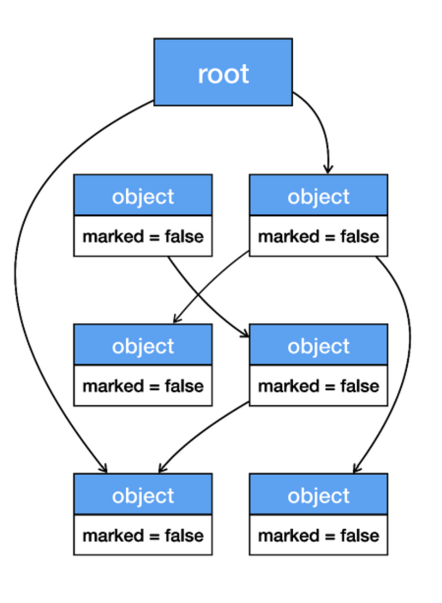
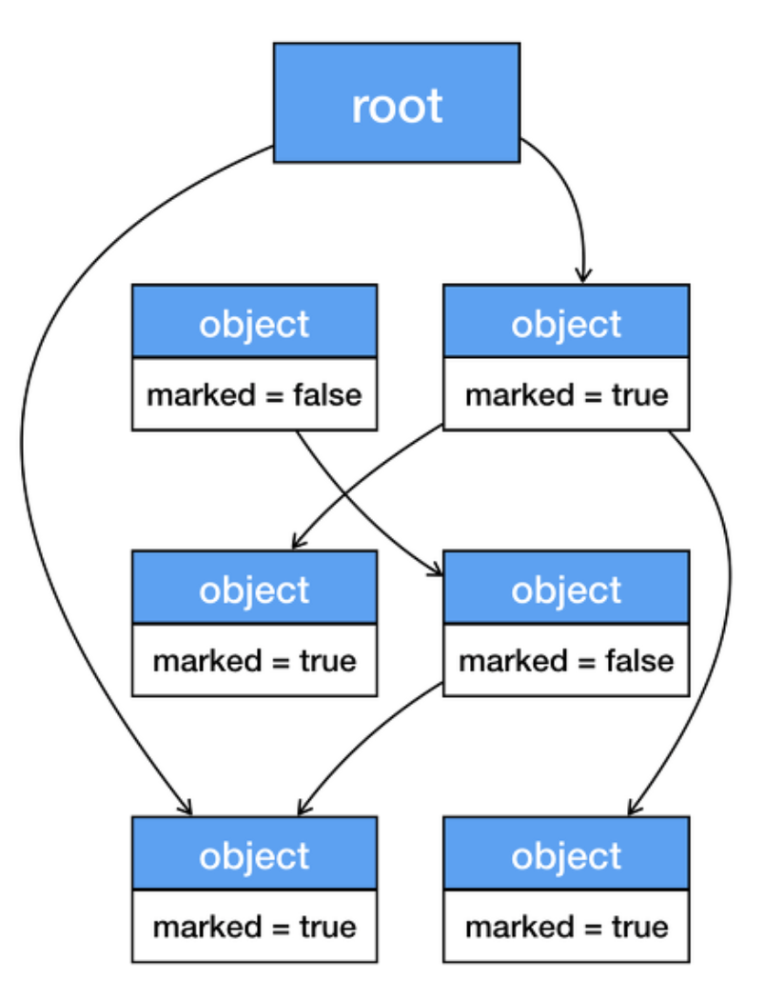
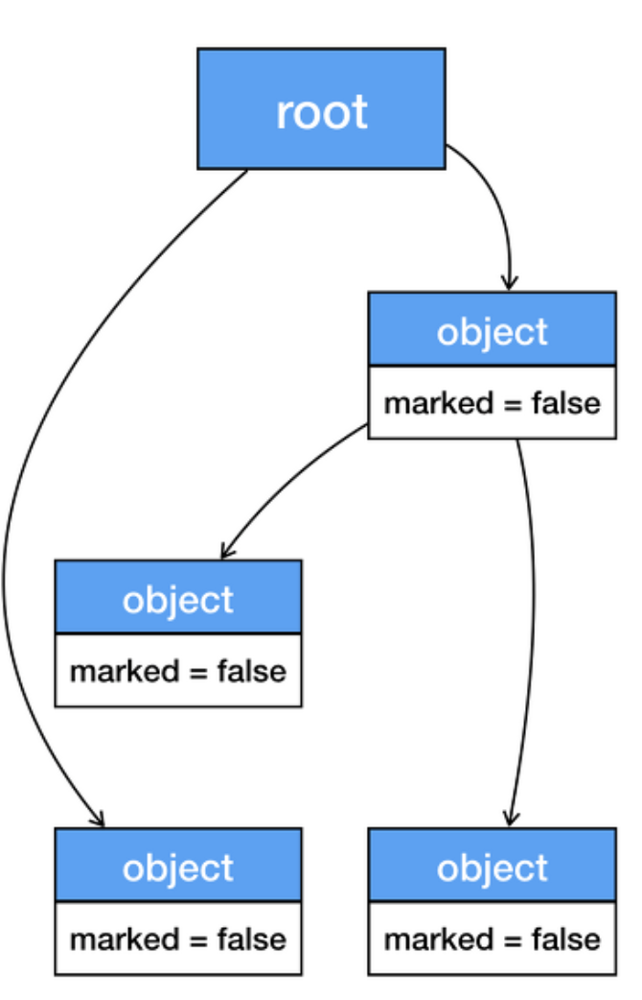

## 메모리 생명 주기

프로그래밍 언어와 상관없이 매모리 생명 주기는 아래와 같이 항상 동일하다.

1. 필요한 메모리 할당
2. 할당된 메모리 사용(읽기, 쓰기)
3. 해당 메모리가 필요 없어지면 해제

## 메모리 할당 및 해제

high level language인 자바스크립트는 필요한 메모리를 자동으로 할당하고 더 이상 사용하지 않는 메모리는 자동으로 회수하지만

**"모든"** 필요없어진 메모리를 해제하는 것은 아니며, 더 이상 필요없는 **"몇몇"의** 메모리를 찾아낸다.

## 필요없는 메모리를 식별하기 위한 방법은 무엇인가요?

### 1. Referenct-counting

파일, 소켓 메모리 슬롯 등 할당된 각 리소스를 가리키는 참조의 수를 계산하는 것.

```jsx
var bar = {
	name: 'bar'
}

bar = ''
```

위에서 **bar**는 새로운 값을 받았기 때문에, **name**은 가비지 콜렉팅 된다.

```jsx
var bar = {
	name: 'bar'
}
var bar 'foo';

function tester() {
	var foo = {};
	bar.name = foo;
	foo.name = bar;
}
tester();
```

위에서는 순환 참조를 만들고있다. **tester** 함수의 **bar**는 **foo**를 참조하고 있다.

일반적으로 함수 실행을 마치면 내부 요소는 **가비지 컬렉팅**이 되지만,

이 경우에는 객체가 서로 참조되고 있어서 가비지 컬렉팅이 되지않는다. 스코프를 벗어났음에도 

GC가 컬렉팅을 하지 않기때문에 메모리 누수가 일어난다. 강제로 null을 할당하여 연결을 끊어준다.

### 2. Mark and Sweep

자바스크립트 최상위 객체인 global(window)에 도달할 수 없는 객체를 찾는 방식이다. 

1. Mark 
객체가 생성될 때마다 mark bit가 0(false)로 설정된다.


step1.

1. Sweep
Mark 이후에 mark bit가 여전히 0(false)로 설정된 객체들을 가지비 콜렉터가 수집해 메모리에서 해제된다.



step2.



step3

- 대부분의 브라우져에서는 이 방법을 사용한다고 한다.

익스플로러는 가비지 컬렉터를 너무 자주 실행하여 성능 문제를 일으키는 것으로 유명했다고 한다.

### 최소한의 메모리 관리에 신경 쓰는 방법

1. 의도치 않은 전역 변수 생성을 막기
2. 잊혀진 타이머 혹은 콜백 함수
3. 사용하지 않는 변수나 객체는 모두 null로 재할당하여 메모리 누수가 일어나지 않도록 하기.