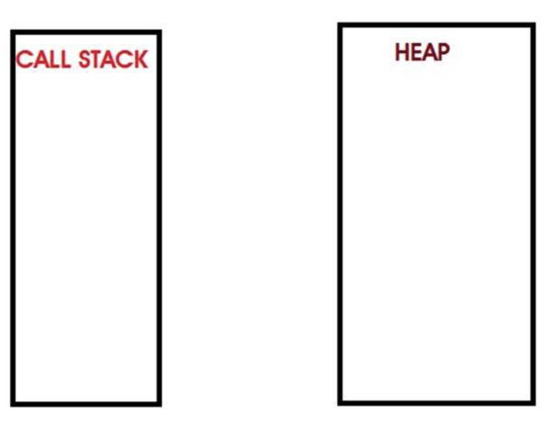
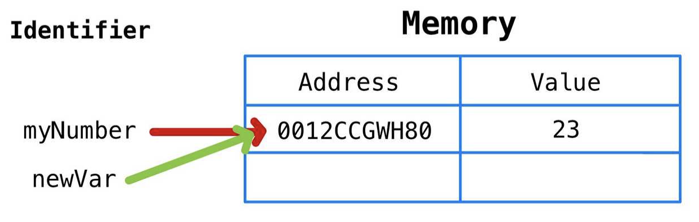
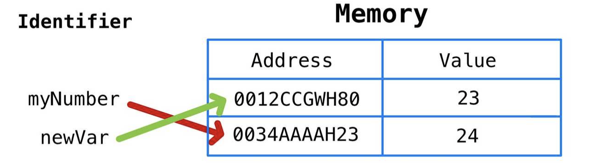
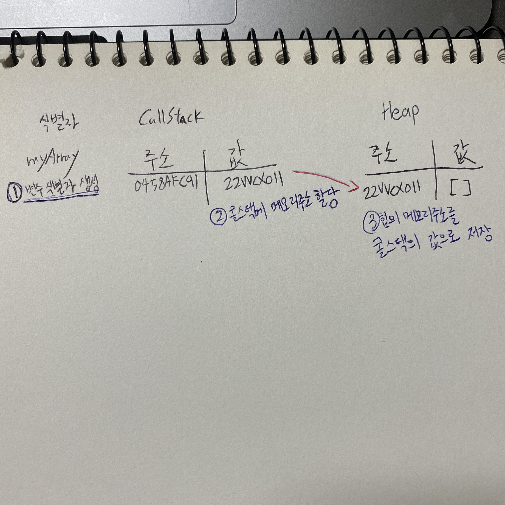

<<<<<<< HEAD
# 자바스크립트의 메모리구조

> 자바스크립트의 메모리구조는 크게 콜스택과 힙 메모리 구조를 통해 데이터 및 코드실행을 관리한다.

## 콜 스택 (Call Stack)

- 원시타입(Number, String, Boolean 등) 데이터가 저장된다.
- 실행컨텍스트를 통해 변수 저장, 스코프체인 및 this관리, 코드 실행 순서 관리를 한다.

## 힙 메모리

- 참조타입(객체, 함수 등) 데이터가 저장된다.

---
todo..
=======
## 자바스크립트 메모리 모델 - 콜스택과 힙



> 콜스택은 원시타입(String, Number, Boolean 등)이 저장되는 공간이며 함수호출도 이곳에 저장된다.

---

## 자바스크립트 원시타입의 변수 선언과 할당 & 콜스택

먼저 자바스크립트에서 변수를 선언하고, 초기화하고, 새로운 값을 할당할 때 어떤일이 일어나는지 알아보자.

```js
let myNumber = 23;
```

이 코드가 실행될 때, 자바스크립트는

1. 변수의 고유 식별자 (myNumber)를 생성한다.
2. 메모리에 주소를 할당한다.
3. 생성된 주소에 값을 저장한다.

newVar라는 새 변수를 만들고 myNumber를 할당한다면...

```js
let newVar = myNumber;
```

myNumber와 newVar의 메모리주소는 같다.



---

만약에 myNumber를 아래와 같이 수정한다면

```js
myNumber = myNumber + 1;
```

자바스크립트는 메모리에 새로운 주소를 할당한다.
그렇다면 위에서 <b>newVar</b>라는 변수도 24라는 값을 가질 것 같지만 자바스크립트의 원시 타입 데이터는 변경불가능하기 때문에 <b>newVar</b>는 그대로 23이라는 값을 가진다. 쉽게말해서 복사의 개념!



---

## 자바스크립트 참조 타입의 변수 선언과 할당 & 힙메모리

```js
let myArray = [];
```

<b>myArray</b>라는 변수를 선언하고 "[]"같은 참조타입을 할당하면 자바스크립트에서는

1. 변수의 고유 식별자는 생성한다. ("myArray")
2. 콜스택의 메모리에 주소를 할당한다.
3. 힙에 할당된 메모리주소를 콜스택의 값으로 저장한다.
4. 힙 메모리 주소에 할당된 값("[]")을 저장한다.



> 힙은 갑자기 데이터가 커질 수도 있는, 배열과 객체 같은 정렬되지 않은 데이터들을 저장할 수 있다는 점이 핵심이다.

---

### 정리

* 콜스택: <b>원시타입 값</b>과 함수 호출의 실행 컨텍스트 저장.
* 힙: 객체, 배열, 함수와 같이 크기가 동적으로 변할 수 있는 <b>참조타입 값</b> 저장
>>>>>>> 2d51c710e46d9969df5fc962163dd189f0b59388
