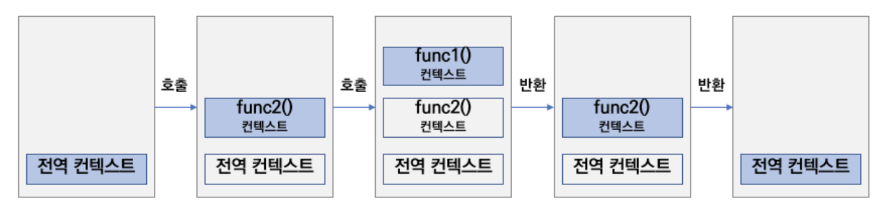
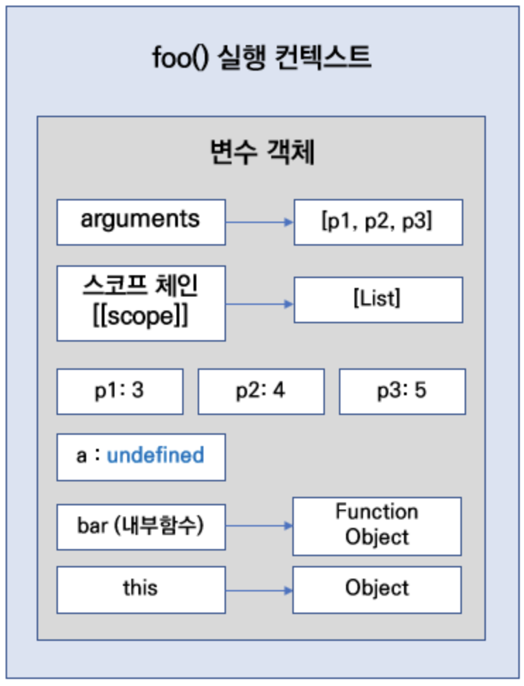

# 자바스크립트 실행 컨텍스트 (Execution Context)

> 자바스크립트에서의 '실행 컨텍스트'란, 실행 가능한 코드가 실행되는 '환경', 실행되기 위해 필요한 환경이라고 할 수 있으며, 스택처럼 쌓이면서 실행 환경을 가지게 된다.

---

<i>예제</i>

```js
console.log("전역 컨텍스트");

function func1() {
  console.log("#func 1");
}

function func2() {
  function1();

  console.log("#func 2");
}
func2();
```

<i>결과</i>

```js
전역 컨텍스트
#func1
#func2
```



---

# 실행 컨텍스트 - 변수 객체, 스코프 체인, this

> 실행 컨텍스트는 물리적으로 생성할 때 변수객체, 스코프체인, this 프로퍼티 등의 속성을 가진다.

---

## 변수객체

자바스크립트 엔진이 해당 컨텍스트에 필요한 정보들 (객체에서 사용할 파라미터, 변수, 객체)를 저장할(각종 정보들을 담아두는) <b>변수 객체</b>를 만든다.

---

## 스코프 체인

변구 객체에는 [[scope]] 프로퍼티에 추가되는 <b>연결 리스트 형태의 스코프 정보</b>가 만들어진다. 이것을 <b>스코프 체인</b>이라고 한다. <b>스코프</b>는 현재 실행중인 컨텍스트의 <b>유효한 범위</b>를 나타낸다.

---

## 현재 실행 컨텍스트 내부에서 사용하는 지역변수 생성

함수 안에 정의된 변수들이나, 내부 함수들이 <b>변수 객체</b>에 생성된다.
이 때에는 변수나 함수 표현식으로 만들어진 함수들은 실행되기 전까지<b>생성만되고 초기화는 되지 않는다.</b> 그래서 <b>undefined</b>인 채로 변수 객체에 생성된다.

---

## this 프로퍼티에 this를 가리키는 객체 저장하기.

<i>아래 코드에서 함수 실행 컨텍스트 내의 변수객체는?</i>

```js
function foo(p1, p2, p3) {
  var a;
  function bar() {
    return a * a;
  }
  return p1 + p2 + p3 + a + bar();
}

foo(3, 4, 5);
```



foo() 실행 컨텍스트의 변수 객체에는 arguments부터 시작하여 스코프체인, 함수 인자에 대한 값, 지역변수, 내부 함수, this 바인딩까지 모든 정보들이 들어간다.
여기서 foo()함수의 this는 전역객체에 바인딩된다.
<b>함수 호출 방식에 따라 달라지는 this 바인딩의 경우를 제외하면 </b>자바스크립트의 this는 <b>기본적으로 전역객체에 바인딩</b>된다.

# 스코프 체인 (todo)