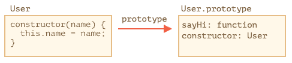

# 클래스와 기본 문법

> 클래스는 객체 지향 프로그래밍에서 특정 객체를 생성하기 위해 변수와 메소드를 정의하는 일종의 틀로, 객체를 정의하기 위한 상태(멤버 변수)와 메서드(함수)로 구성된다.

## 기본문법

```js
class MyClass {
  constructor() { ... }
  method1() { ... }
  method2() { ... }
}
```

이렇게 클래스를 만들고, new MyClass()를 호출하면 내부에서 정의한 메서드가 들어있는 객체가 생성된다.
객체의 기본 상태를 설정해주는 생성자 method인 <b><em>constructor()</em></b>는 "new"에 의해 자동으로 호출되므로, 특별한 절차 없이 객체를 초기화 할 수 있다!

---

<i>예시</i>

```js
class User {
  constructor(name) {
    this.name = name;
  }

  sayHi() {
    alert(this.name);
  }
}

let user = new User("jay");
user.sayHi();
```

### new User("jay")가 호출되면 일어나는 일

1. 새로운 객체가 생성된다.
2. 넘겨받은 파라미터와 함께 <i>constructor</i>가 자동으로 실행된다.
3. 파라미터 "jay"가 this.name에 할당된다.

이 과정들이 끝나면 user.sayHi() 같은 객체 메서드를 호출할 수 있다.

---

## 클래스란 무엇일까?

> 클래스는 자바스크립트에서 함수의 한 종류이다.

```js
alert(typeof User); // function 으로 확인가능하다.
```

### 클래스가 하는 일

1. User 라는 이름을 가진 함수를 만든다. 함수 본문은 생성자 method인 <i>constructor</i>에서 가져온다. 생성자 메서드가 없으면 본문이 비워진 채로 함수가 만들어진다.
2. sayHi() 같은 클래스 내에서 정의한 메서드를 User.prototype에 저장한다.



```js
class User {
  constructor(name) {
    this.name = name;
  }
  sayHi() {
    alert(this.name);
  }
}

// 클래스는 함수입니다.
alert(typeof User); // function

// 정확히는 생성자 메서드와 동일합니다.
alert(User === User.prototype.constructor); // true

// 클래스 내부에서 정의한 메서드는 User.prototype에 저장됩니다.
alert(User.prototype.sayHi); // alert(this.name);

// 현재 프로토타입에는 메서드가 두 개입니다.
alert(Object.getOwnPropertyNames(User.prototype)); // constructor, sayHi
```

---

## 클래스 표현식

<i>클래스 표현식</i>

```js
let User = class {
  sayHi() {
    alert("Hello");
  }
};
```

<i>함수 표현식처럼 클래스 표현식에도 이름을 붙일 수 있다.</i>

```js
// 기명 클래스 표현식(Named Class Expression)
// (명세서엔 없는 용어이지만, 기명 함수 표현식과 유사하게 동작합니다.)
let User = class MyClass {
  sayHi() {
    alert(MyClass); // MyClass라는 이름은 오직 클래스 안에서만 사용할 수 있습니다.
  }
};

new User().sayHi(); // 제대로 동작합니다(MyClass의 정의를 보여줌).

alert(MyClass); // ReferenceError: MyClass is not defined, MyClass는 클래스 밖에서 사용할 수 없습니다.
```

---

## getters와 setter

클래스도 getter나 setter, 계산된 프로퍼티를 포함할 수 있다.

<i>get과 set을 이용해 user.name을 조작하기</i>

```js
class User {
  constructor(name) {
    // setter를 활성화합니다.
    this.name = name;
  }

  get name() {
    return this._name;
  }

  set name(value) {
    if (value.length < 4) {
      alert("이름이 너무 짧습니다.");
      return;
    }
    this._name = value;
  }
}

let user = new User("John");
alert(user.name); // John

user = new User(""); // 이름이 너무 짧습니다.
```

---

## 계산된 메서드 이름 [...]

<i>대괄호 [...]를 이용한 계산된 메서드 이름을 만드는 예시</i>

```js
class User {
  ["say" + "Hi"]() {
    alert("hello");
  }
}

new User().sayHi();
```

---

## 클래스 필드

> 클래스 필드라는 문법을 사용하면 어떤 종류의 프로퍼티도 클래스에 추가할 수 있다.

<i>클래스 User에 name 프로퍼티 추가하기</i>

```js
class User {
  name = "John";

  sayHi() {
    alert(`Hello, ${this.name}!`);
  }
}

new User().sayHi(); // Hello, John!
```

클래스를 정의할 떄 <i><b>프로퍼티 이름 = 값</b></i> 을 써주면 클래스 필드를 만들 수 있다.

> 클래스 필드의 중요한 특징 중 하나는 User.prototype이 아닌 개별 객체에만 클래스 필드가 설정되는 것이다.

```js
class User {
  name = "John";
}

let user = new User();
alert(user.name); // John
alert(User.prototype.name); // undefined
```

---

## 클래스 필드로 바인딩 된 메서드 만들기

> 자바스크립트의 함수는 동적인 this를 갖는다.

<i>잃어버린 this</i>

```js
class Button {
  constructor(value) {
    this.value = value;
  }

  click() {
    alert(this.value);
  }
}

let button = new Button("hello");
setTimeout(button.click, 1000); // undefined
```

해결법

1. setTimeout(() => button.click(), 1000) 같이 래퍼 함수 전달하기
2. 생성자 안에서 메서드 객체를 바인딩하기.

<i>해결법 예시</i>

```js
class Button {
  constructor(value) {
    this.value = value;
  }
  click = () => {
    alert(this.value);
  };
}

let button = new Button("hello");

setTimeout(button.click, 1000); // hello
```

이처럼 <b style="font-size: 15px;">click = () => { } 는 각 button 객체마다 독립적인 함수를 만들고</b> 함수의 this를 함수객체에 바인딩시켜준다. 개발자는 button.click을 아무곳에서나 전달 가능하고 this엔 항상 의도한 값이 들어가게 된다.
