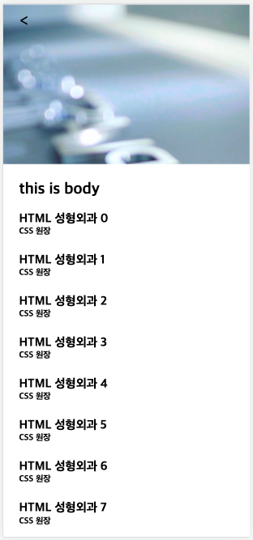
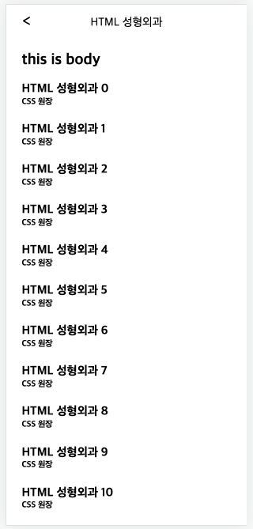

## 스크롤이 내려가면 고정되는 헤더 만들기

지금 진행 예정인 프로젝트에서 병원을 소개하는 전경 이미지를 최상단에 위치하고,
아래로 스크롤이 내려가면 헤더에 뒤로가기 아이콘과, 병원이름을 타이틀에 넣고싶었다.

그냥 헤더에 absoulte 또는 sticky를 속성을 주면 편하겠지만
간단하게나마 조금 더 나은 /UI/UX를 만들어보고 싶었다.

---

### HTML

```html
<!DOCTYPE html>
<html lang="en">
  <head>
    <meta charset="UTF-8" />
    <meta http-equiv="X-UA-Compatible" content="IE=edge" />
    <meta name="viewport" content="width=device-width, initial-scale=1.0" />
    <link rel="stylesheet" href="./css/sticky.css" />
    <title>sticky-header</title>
  </head>
  <body>
    <header class="header">
      <div class="header-icon"><</div>
      <span class="header-title"></span>
    </header>

    <section class="body">
      <p><h1>this is body</h1><br/></p>
    </section>
  </body>
</html>
```

---

```css
* {
  margin: 0;
  padding: 0;
  box-sizing: border-box;
}
.header {
  width: 100%;
  height: 244px; // 병원 전경 이미지 size
  font-size: 25px;
  padding: 12px 0;

  display: flex;
  justify-content: center;

  background: url("../img/img.png") no-repeat;
  background-size: 100% 100%;
}
.header-icon {
  position: absolute;
  left: 24px;
  top: 12px;
}
.header-title {
  font-size: 18px;
  margin-top: 5px;
}

.header.drop {
  height: 50px;
  z-index: 100;
  position: fixed;
  background: #fff;
  box-sizing: border-box;
  animation: dropHeader 0.3s;
}

@keyframes dropHeader {
  0% {
    top: 1px;
  }
  100% {
    top: 0px;
  }
}

.body {
  width: 100%;
  padding: 24px;
  box-sizing: border-box;
}

.drop-body {
  padding-top: 318px; // .header, header.drop 헤더의 height + 본문 padding
  z-index: 100;
}
```

---

```javascript
const header = document.querySelector(".header");
const body = document.querySelector(".body");
const title = document.querySelector(".header-title");
let headerHeight = header.offsetHeight;

for (let i = 0; i < 20; i++) {
  let h3 = document.createElement("h3");
  let h5 = document.createElement("h5");

  body.appendChild(h3);
  h3.innerText = `HTML 성형외과 ${i}`;

  body.appendChild(h5);
  h5.innerText = "CSS 원장";

  h5.setAttribute("style", "margin-bottom: 24px;");
}

window.onscroll = () => {
  const windowTop = window.scrollY;
  if (windowTop > headerHeight) {
    header.classList.add("drop");
    body.classList.add("drop-body");
    title.innerText = "HTML 성형외과";
  } else {
    header.classList.remove("drop");
    body.classList.remove("drop-body");
    title.innerText = "";
  }
};
```




