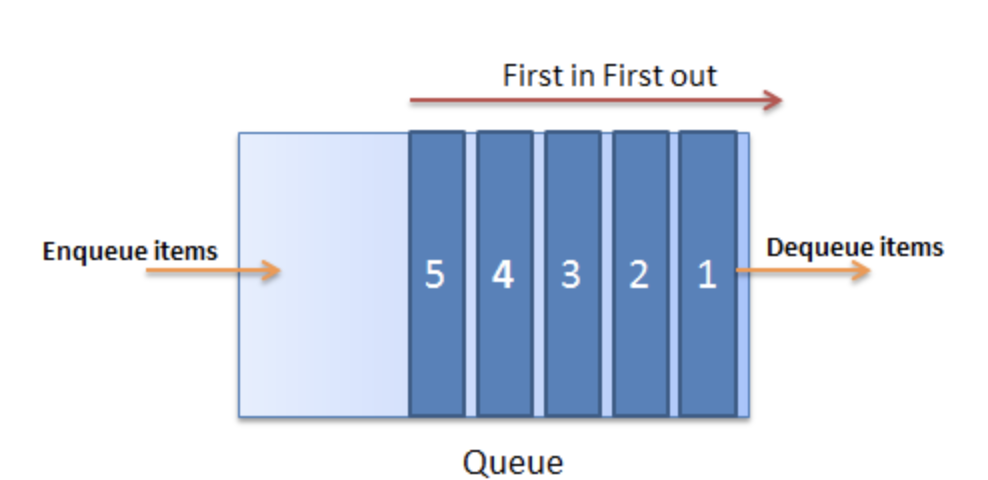

# Queue 큐

> first in, first out 원칙으로 만들어진 자료구조이다.



## Queue의 속성

- 데이터를 집어넣는 <b>enqueue</b>
- 데이터를 추출하는 <b>dequeue</b>
- 현재 데이터의 길이 <b>length</b>
- 다음에 나올 데이터를 확인하는 <b>peek</b>
- 현재 큐가 비었는지 확인하는 <b>isEmpty</b>
- 현재 큐를 초기화하는 <b>clear</b>

<i>예제코드</i>

```js
class Queue {
  constructor() {
    this.arr = [];
  }

  // 데이터 집어넣기
  enqueue(value) {
    this.arr.push(value);
  }

  // 데이터 추출
  dequeue() {
    return this.arr.shift();
  }

  // 데이터의 길이
  length() {
    return this.arr.length;
  }

  // 다음에 나오는 데이터 확인
  peek() {
    return this.arr[0];
  }

  // 큐가 비었는지 확인하기
  isEmpty() {
    return this.arr.length === 0;
  }

  // 큐 초기화
  clear() {
    this.arr = [];
  }
}

const queue = new Queue();

// 데이터 삽입
queue.enqueue(1); // arr: [1]
queue.enqueue(20); // arr: [1, 20]
queue.enqueue(300); // arr: [1, 20, 300]

// 데이터 추출
queue.dequeue(); // 1

// 현재 큐 길이
queue.length(); // 2

// 다음에 추출될 데이터
queue.peek(); // 20

// 큐가 비어있는지 확인
queue.isEmpty(); // false

// 큐 초기화
queue.clear();
```
